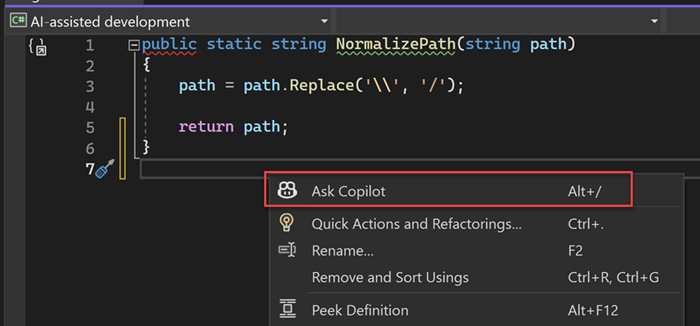
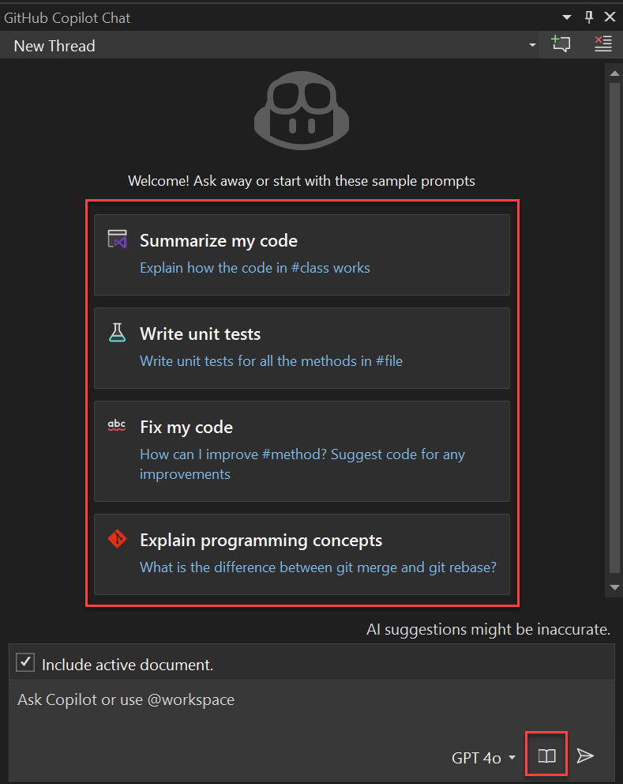
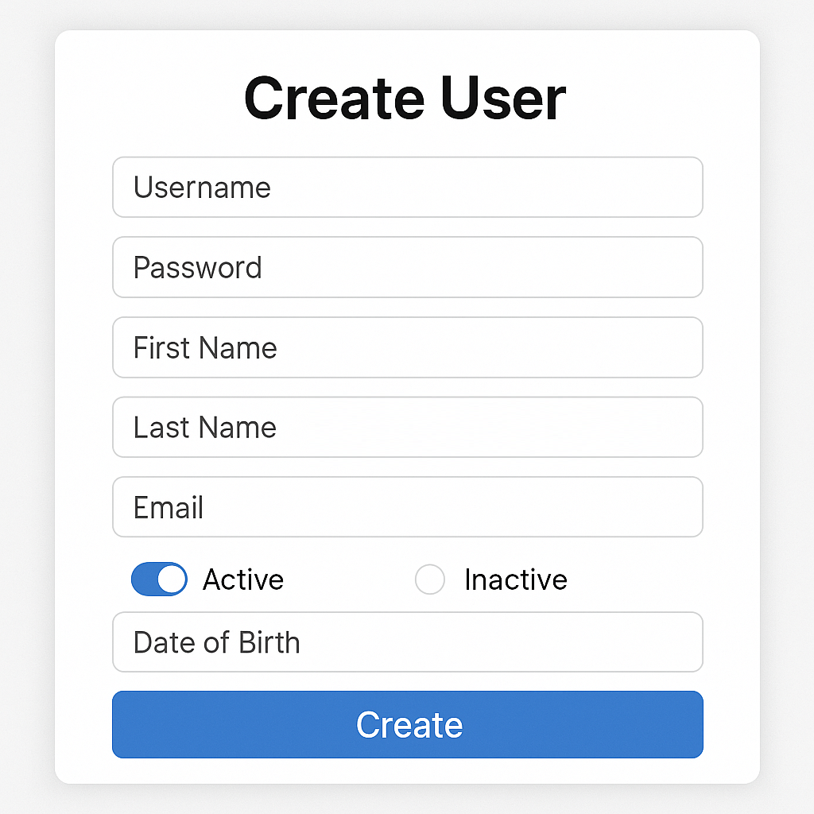
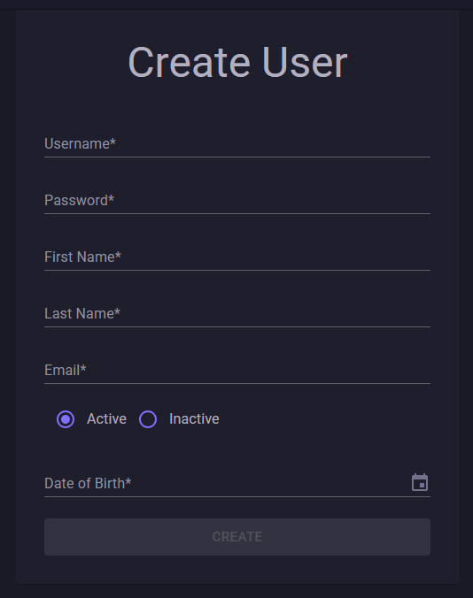

# GitHub Copilot

 <!-- .element: style="height: 500px; margin: 0;" -->

---

## Prerequisites 🔧

To use GitHub Copilot Chat in Visual Studio

- Visual Studio 2022 v17.8 or later <!-- .element: class="fragment fade-in-then-semi-out" -->
- GitHub account with Copilot access <!-- .element: class="fragment fade-in-then-semi-out" -->
- GitHub Copilot & Copilot Chat installed <!-- .element: class="fragment fade-in-then-semi-out" -->

---

## Code completions ⚡


---

## Inline Chat 💬

 <!-- .element: style="margin: 0;" -->

---

## Chat Window 💬

 <!-- .element: style="height: 600px; margin: 0;" -->

---

## Slash Commands 🚀

Quickly specify tasks

<ul>
<li class="fragment fade-in-then-semi-out"><code>/doc</code> - Add documentation</li>
<li class="fragment fade-in-then-semi-out"><code>/explain</code> - Explain code</li>
<li class="fragment fade-in-then-semi-out"><code>/fix</code> - Suggest fixes</li>
<li class="fragment fade-in-then-semi-out"><code>/optimize</code> - Improve code</li>
<li class="fragment fade-in-then-semi-out"><code>/tests</code> - Create unit tests</li>
<li class="fragment fade-in-then-semi-out"><code>/help</code> - Get help on Copilot chat</li>
</ul>

---

## Scope with References 🎯

Control Copilot's context:

<ul>
<li class="fragment fade-in-then-semi-out"><code>#FileName.cs</code></li>
<li class="fragment fade-in-then-semi-out"><code>#MethodName</code></li>
<li class="fragment fade-in-then-semi-out"><code>#solution</code> or <code>@workspace</code></li>
<li class="fragment fade-in-then-semi-out"><code>@github</code> (Enterprise)</li>
</ul>

---

## Attach Images 🖼️

- Available in VS 17.14 Preview 1+ <!-- .element: class="fragment fade-in-then-semi-out" -->
- Provide visual context for better responses <!-- .element: class="fragment fade-in-then-semi-out" -->
- Combine with slash commands & references <!-- .element: class="fragment fade-in-then-semi-out" -->

---

<blockquote style="font-size: 0.8em;">
I want this page to look like this image, <br/>
as you can see in the #solution we are using mudblazor components.
</blockquote>

 <!-- .element: style="height: 400px; margin: 0;" -->

---

 <!-- .element: style="height: 600px; margin: 0;" -->
---

```csharp
public class UserModel
{
   public string Username { get; set; } = string.Empty;
   public string Password { get; set; } = string.Empty;
   public string FirstName { get; set; } = string.Empty;
   public string LastName { get; set; } = string.Empty;
   public string Email { get; set; } = string.Empty;
   public bool IsActive { get; set; } = true;
   public DateTime? DateOfBirth { get; set; }
}
```

---

## Models 🧠

The best model depends on your use case

| Model | Best For | Key Strengths |
|-------|----------|---------------|
| GPT-4o | Fast, general-purpose, multimodal tasks | Speed, multilingual, visual input, explanations |
| o1 (Preview) | Debugging, deep logical reasoning | Step-by-step analysis, optimization |
| o3-mini | Simple, repetitive coding, fast feedback | Low latency, concise suggestions |
| Claude 3.5 Sonnet | Everyday coding, cost-efficient support | Fast, clear, low resource usage |
| Claude 3.7 Sonnet | Complex, structured, multi-file code tasks | Context retention, hybrid reasoning |

---

## Custom instructions 📋

Add pre-specified contextual details to your chat questions

<ul>
<li class="fragment fade-in-then-semi-out"><code>.github/copilot-instructions.md</code></li>
<li class="fragment fade-in-then-semi-out">In the root of your repository</li>
<li class="fragment fade-in-then-semi-out">Enable the feature in Visual Studio Options</strong></li>
</ul>

---

<p class="small-note" style="color:#F1B300; font-size: 0.6em;">custom-instructions.md file</p>

```md
# Copilot Instructions

This document provides guidelines for using GitHub Copilot within the solution, ensuring generated code aligns with the project's coding standards and testing practices.

## General Guidelines

1. **Code Style**:
   - Follow C# 13.0 and .NET 9 conventions
   - Use nullable reference types (`<Nullable>enable</Nullable>`)
   - Enable implicit usings (`<ImplicitUsings>enable</ImplicitUsings>`)
   - Prefer async/await for asynchronous operations
   - Use dependency injection for services and repositories
   - Follow existing parameter naming conventions (e.g., `ct` for CancellationToken)

2. **Testing Style**:
   - Use `[Fact]` for single test cases
   - Use `[Theory]` with `[UnitTest]` attribute for parameterized tests
   - Follow the Arrange-Act-Assert pattern
   - Use descriptive test method names with format `MethodName_Should_ExpectedBehavior`
   - Group test files under Feature directories matching the implementation structure

3. **Blazor Conventions**:
   - Use MudBlazor components and follow their design patterns
   - Implement `IDisposable` for components that subscribe to events
   - Register services and state containers appropriately
   - Use dependency injection for component dependencies

## Third-Party Libraries

The solution uses these key libraries. Generated code should integrate with them:

### Testing Libraries
- **xunit.v3**: Primary testing framework
- **AutoFixture.Xunit3**: For test data generation
- **FakeItEasy**: For mocking and test doubles
- **FluentAssertions**: For fluent assertion syntax
- **Verify**: For snapshot testing

### Database & ORM
- **EFCore.MockBuilder**: For mocking EF Core contexts
- **EntityFrameworkCore.AutoFixture**: For EF Core test data
- **Microsoft.EntityFrameworkCore.SqlServer**: For database access

### Authentication & Security
- **Azure.Security.KeyVault.Secrets**: For secret management
- **Microsoft.AspNetCore.Authentication.JwtBearer**: For JWT authentication

### UI Components
- **MudBlazor**: For Blazor component library


## Additional Guidelines

1. **Test Data Generation**:
   - Use `[Frozen]` attribute for dependencies that should remain consistent
   - Use AutoFixture for generating test entities and DTOs
   - Create specific test fixtures for reusable test data setup

2. **Mocking**:
   - Use FakeItEasy's `A.CallTo()` syntax for method mocking
   - Use `A.Fake<T>()` for creating test doubles
   - Mock only what's necessary for the test

3. **Assertions**:
   - Use FluentAssertions for readable assertions
   - Chain assertions for related checks
   - Use appropriate assertion methods (e.g., `Should().BeTrue()`, `Should().BeAssignableTo<T>()`)

4. **Database Testing**:
   - Use in-memory context or mocked context for unit tests
   - Use EFCore.MockBuilder for complex database scenarios
   - Test both success and error paths

## Code Examples
...
```

---

## Organize with Threads 🧵

- Start new threads for different tasks <!-- .element: class="fragment fade-in-then-semi-out" -->
- Switch between threads easily <!-- .element: class="fragment fade-in-then-semi-out" -->
- Promote inline chats to main chat window <!-- .element: class="fragment fade-in-then-semi-out" -->
- Delete irrelevant requests <!-- .element: class="fragment fade-in-then-semi-out" -->

---

## Demo Time 🎬

---

## Best Practices ⭐

- Use threads to manage context <!-- .element: class="fragment fade-in-then-semi-out" -->
- Iterate on prompts for better answers <!-- .element: class="fragment fade-in-then-semi-out" -->
- Try different models <!-- .element: class="fragment fade-in-then-semi-out" -->
- Learn Prompt Engineering <!-- .element: class="fragment fade-in-then-semi-out" -->
- Review responses <!-- .element: class="fragment fade-in-then-semi-out" -->

---

## The End 👋